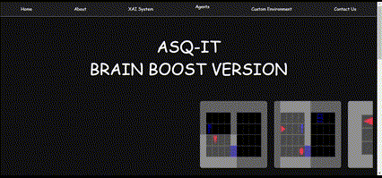

# Project Overview

This project is a collaborative effort between The Technion and University of Haifa, aimed at developing a unique interactive tool for predicting and analyzing agent behavior in both virtual and real-world environments. The tool is designed to assist researchers and users by providing video outputs that match specific behavioral scenarios described through textual queries. By simulating temporal behaviors or events, the tool enhances research capabilities in fields such as reinforcement learning, artificial intelligence, and agent behavior prediction.

 

 

## Feature 1: Customizable Agent Training with Reinforcement Learning

The tool provides users the ability to train reinforcement learning agents using either predefined or fully customizable parameters, allowing for fine-tuned control over the training process. Users can adjust the following parameters:

- **Seed**: Initialize the training with a specific seed for reproducibility.
- **Number of Processes**: Specify the number of parallel processes for faster training.
- **Number of Frames**: Set the total number of frames used during training.
- **Epochs**: Define how many full passes the model makes over the training data.
- **Batch Size**: Control the number of samples processed before updating the model.
- **Discount Factor**: Set the discount rate for future rewards (γ).
- **Learning Rate**: Specify the step size for gradient updates.
- **Entropy Coefficient**: Adjust the exploration-exploitation tradeoff.
- **Adam Optimizer Epsilon**: Set the epsilon parameter for stability in the Adam optimizer.
- **RMSprop Optimizer Alpha**: Control the smoothing factor for the RMSprop optimizer.
- **Number of Backsteps to Propagate**: Set how many steps back in time the algorithm looks when updating the agent's actions.
- **Max Norm of Gradient**: Prevent gradient explosion by setting a maximum allowable norm for gradients.

This flexibility allows researchers to simulate and analyze a wide range of agent behaviors, adapting to various scenarios and environments efficiently.

## Feature 2: Graphical Visualization of Agent Behavior

In addition to customizable training, the project offers a graphical interface that provides detailed visualizations of the agent's behavior across different environments. This feature enables users to observe and analyze how agents respond to various stimuli, environments, and tasks in real-time or post-training.

The visualizations allow researchers to:

- **Track Agent Movements**: Observe agent paths and decision-making processes over time.
- **Monitor Interactions**: Visualize how agents interact with objects, obstacles, and other agents in the environment.
- **Behavioral Insights**: Gain insights into key moments, such as when agents learn optimal strategies, fail, or adapt their behavior in response to changes.
- **Real-time and Post-training Visualization**: Users can either view the behavior of agents as it unfolds in real-time or analyze recorded behaviors after training has concluded.

This graphical visualization tool is crucial for better understanding agent behaviors in complex scenarios and helps bridge the gap between theoretical training data and real-world applications.

## Feature 3: XAI System (Explainable AI System)

The centerpiece of this project is the **XAI System (Explainable AI System)**, a powerful tool that revolutionizes the way users interact with and understand agent behaviors. By leveraging advanced explainability techniques, the XAI system provides a transparent and intuitive interface for exploring complex reinforcement learning outcomes. It is designed to bridge the gap between sophisticated AI algorithms and human interpretation, making it easier for researchers, developers, and educators to gain meaningful insights from agent-environment interactions.

  
 
  

### Key Capabilities of the XAI System

- **Agent and Environment Selection**: The system offers users the freedom to select from a broad selection of agents, each with unique behaviors and learning patterns. Additionally, users can choose from a wide range of predefined **MiniGrid environments**—virtual worlds designed to simulate various challenges and tasks. Whether it’s a simple maze or a more complex puzzle environment, the system provides rich scenarios for the agent to navigate, allowing for diverse and nuanced behavior analysis.

- **Customizable Event Queries**: One of the most innovative aspects of the XAI System is the ability to customize event queries. Users can define a range of events they are interested in, such as an agent finding a key, avoiding an obstacle, or reaching a specific goal. The system accommodates a variety of behaviors, from routine interactions to rare occurrences, making it highly adaptable to different research or project needs.

- **Episode Retrieval**: Once the user defines the agent, environment, and events of interest, the XAI System processes the data and identifies all relevant episodes where the specified events occurred. These episodes provide a comprehensive view of the agent's decision-making process during critical moments, offering users a granular look into the agent's performance.

- **Video Output and Analysis**: The system doesn’t just provide raw data—it returns full video outputs of the episodes where the selected events took place. This feature enables users to visually analyze how and why agents acted in specific ways during key moments. By reviewing these videos, users can detect patterns, assess the effectiveness of training, and gain a clearer understanding of the agent's thought process. Whether it’s for research, education, or AI model validation, these videos are instrumental in making agent behavior interpretable and accessible.

### Unified Environment Structure with GameStateTracker

To ensure efficiency and consistency across different environments, the project is built on a **generic code structure** that applies to all environments. This standardized structure allows the system to manage a wide range of environments while maintaining flexibility for different agent behaviors and events.

At the heart of this system is the **GameStateTracker**, a critical component designed to track the state of each episode in real-time. The **GameStateTracker** monitors key events, agent actions, and environmental changes throughout each episode, ensuring accurate logging and retrieval of relevant information. This tracking process is essential for the **XAI System**, as it identifies the moments when the user-defined events occur, helping the system to pinpoint and extract the right video segments for analysis.

By using this **GameStateTracker**, the system guarantees that the episodes retrieved for the user contain the exact events of interest, allowing for precise, explainable video outputs. The combination of a unified environment structure and the state-tracking mechanism enables seamless integration across different environments, making the system both robust and highly adaptable to various use cases.

### Video Clipping for Efficiency

To further enhance the efficiency of the visualization process, the project includes an **option for video clipping**. If the retrieved episodes result in videos that are too long for effective review, users have the option to receive **clips** of the relevant portions, rather than the entire video. This feature focuses on delivering shorter, more manageable video clips that highlight the key moments where the specified events occurred.

By providing clips instead of full-length episodes, this feature ensures that users can quickly and efficiently analyze agent behavior without the need to sift through lengthy recordings. This is especially useful for large-scale studies or when analyzing multiple episodes, significantly improving the overall user experience and making the visualization process much more efficient.

## Feature 4: Custom-Made Environments

Recognizing the limitations of pre-made MiniGrid environments, we’ve added the ability for users to create fully **custom environments**. This feature allows for complete control over the environment’s structure, letting users tailor every aspect to fit specific scenarios or research needs. Users can define custom map sizes, objects, obstacles, and goals, enabling experimentation with entirely new environments and challenges, making it an incredibly versatile tool for exploring agent behavior under a wide variety of conditions.

Additionally, users can **train agents on these custom environments**, applying reinforcement learning techniques with fully customizable parameters. This feature enhances the flexibility of the system, allowing for the creation of unique environments and tailored agent training experiences.

### Key Customization Options

- **Map Size**: Users can define the dimensions of the environment, adjusting it to suit different scales of complexity and exploration.
  
- **Lava**: Add or remove lava tiles to create hazards that agents must navigate around or avoid, adding a layer of difficulty and strategic challenge.

- **Keys and Key Colors**: Users can place keys within the environment and choose their colors. This adds variety to agent-object interaction and can be used to create more complex puzzles and tasks.

- **Locked/Unlocked Doors**: Set up doors that require agents to unlock them using specific keys, creating more advanced task sequences and introducing dependencies between objects and rewards.

- **Goals**: Define the end goals for the agent, whether it's reaching a specific location, collecting an object, or triggering a certain event. These goals help shape the agent’s learning process and influence its behavior within the environment.

The custom environments are fully compatible with all the features above provided by the system.

## Upcoming Features

As part of our ongoing commitment to expanding and improving the capabilities of the project, several exciting features are planned for future updates. These additions aim to enhance the agent’s functionality, increase flexibility for the user, and expand the range of environments the system can handle.

### 1. Enhanced Text Understanding with LLM Integration

While the agent already has a basic understanding of text-based inputs, we plan to significantly boost this capability by integrating a **Large Language Model (LLM)**. This will allow the agent to understand and process more complex user commands, opening the door for **natural language interaction**. 

Instead of relying on predefined options for environment settings, event queries, and actions, users will soon be able to input textual instructions or speech commands. The LLM will interpret these inputs, providing a more fluid and intuitive way to interact with the system. This feature is expected to revolutionize how users create environments, train agents, and query events by making the interface more flexible and user-friendly.

### 2. More Diverse and Sparse Reward System

One of the current limitations of existing MiniGrid environments is the simplicity of their reward systems. We are planning to introduce a **sparse rewards system** that offers greater diversity in how rewards are allocated. 

This new system will allow for more sophisticated reinforcement learning by distributing rewards not just for goal achievement but based on various metrics, such as efficiency, exploration, or interaction with specific objects. The richer reward structures will enable users to train agents in more complex, real-world-aligned tasks, moving beyond the rigid constraints of traditional environments.

### 3. Custom Objects with Custom Behaviors

In future updates, we will enable the ability to create and incorporate **custom objects** into environments. These objects can have unique behaviors and properties, opening up new possibilities for both research and practical applications.

As we dive deeper into OpenAI’s source code for MiniGrid, we are getting closer to making this a reality. Users will be able to add objects with specific roles—such as tools, obstacles, or interactive elements—that go beyond what is currently possible with standard MiniGrid objects. This will allow for the creation of far more intricate and realistic environments, pushing the boundaries of agent training.

### 4. Expansion to Real-Life Environments

While the current system primarily focuses on virtual environments, we are working on expanding it to operate in **real-life environments**. Leveraging advancements in **computer vision**, **image processing**, and **reinforcement learning**, we aim to create a framework where agents can operate in physical spaces.

This feature will be particularly useful for real-world applications such as robotics, autonomous systems, and AI-driven decision-making in physical environments. By allowing agents to perceive and interact with the real world, the system could be used in industries ranging from manufacturing to autonomous driving, bringing the power of AI out of the virtual realm and into real life.

## References and Acknowledgments

This project would not have been possible without the contributions and resources provided by various individuals and organizations. We would like to extend our thanks to the following:

1. **OpenAI Documentation**: For providing access to a comprehensive range of open-source tools, libraries, and educational resources that played a crucial role in the development of this project.

2. **The Team at University of Haifa and The Technion**: A special thank you to our collaborators and colleagues from both institutions, whose expertise and partnership were instrumental in making this project a reality.

3. **Research Resources**: 
   - [OpenAI Research on Explainable AI](https://arxiv.org/abs/2301.09941) 
   - [IEEE Xplore - Reinforcement Learning in Robotics](https://ieeexplore.ieee.org/document/9372847)

4. **Lucas Williams**: For his outstanding contributions to the fundamentals of reinforcement learning algorithms, which greatly informed and influenced the direction of this project.

We are grateful to all these contributors for their insights and resources, without which this project could not have achieved its current scope and depth.

## Contact Us
If you have any suggestions, feedback, or inquiries regarding this project, please feel free to reach out to us. We highly value your input and look forward to hearing your thoughts.

Aisha Abu dahesh: aishadahesh11@gmail.com
Ramiz Srour: ramiz.srour1@gmail.com

